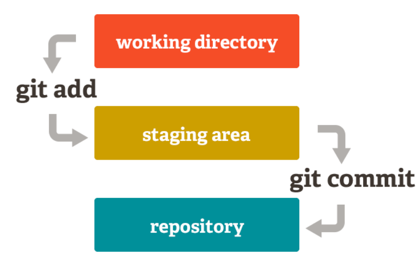
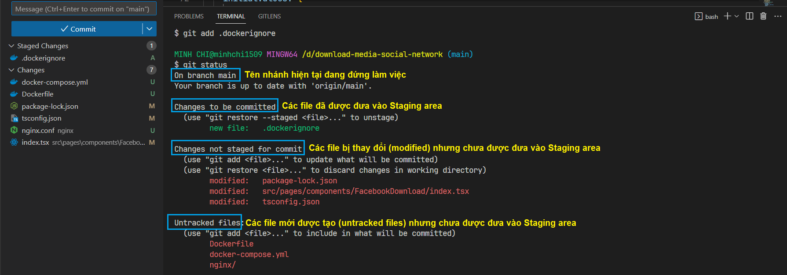
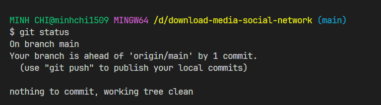
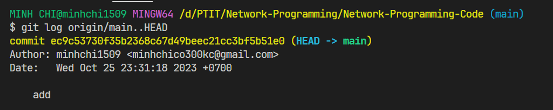

# Quản lý file và đẩy code lên remote trong git

Trong git có 3 nơi:

- **Working directory** : Đây là nơi mà bạn đang code cho project
- **Staging area** : Chính là nơi lưu trữ các thay đổi trước khi commit. Khi bạn gõ `git add` thì các thay đổi sẽ được lưu tại đây.
- **Repository** : chính là project khi đã commit. Khi bạn gõ `git commit` thì các thay đổi sẽ được lưu tại đây.



## Kiểm tra trạng thái

```bash
git status
```

Lệnh `git status` trong Git được sử dụng để hiển thị trạng thái của các tệp tin và thư mục trong thư mục làm việc ( **Working directory** ) và cả trạng thái của những tệp tin đã được theo dõi (tracked) trong **Staging area** .

Khi bạn chạy `git status`, Git sẽ hiển thị các thông tin như:

- Những tệp tin đã được chỉnh sửa và chưa được đưa vào **Staging area** .
- Những tệp tin đã được thêm vào **Staging area** sẽ được commit trong lần commit tiếp theo.
- Những tệp tin đã bị xóa.
- Các nhánh hiện tại và trạng thái của việc bạn đang làm việc trong nhánh nào.





- Câu lệnh sau sẽ liệt kê các commit đã được tạo nhưng chưa đẩy lên remote repository:

```bash
git log origin/main..HEAD
```



## Đưa file vào Staging area

- Để đưa file đã được thay đổi vào **Staging area** , ta dùng lệnh sau:

```bash
git add <file_path> // Đưa file cụ thể vào Staging area. Ví dụ như "git add src/App.tsx"
git add . // Đưa tất cả các file vào Staging area
```

- Để đưa file quay trở lại **Working directory** :

```bash
git restore --staged <file_path> // Đưa file cụ thể từ Staging area quay trở lại Working directory
git restore --staged . // Đưa tất cả các file từ Staging area quay trở lại Working directory
```

## Commit

- Tiếp theo, ta tạo commit với một nội dung message nào đó:

```bash
git commit -m "Message"
```

## Push

- Sau khi đã thực hiện add và commit xong, ta có thể đẩy code lên **Remote repository** thông qua câu lệnh sau:

```bash
git push -u origin <branch_name>
```

:::info

Trong đó:

- **<branch_name>** : tên nhánh ở remote repository mà code sẽ được đẩy lên. Nếu nhánh này chưa có ở remote repository thì nó sẽ được tự động tạo.

:::

## Discard Changes

- Lệnh sau sẽ khôi phục tệp tin về trạng thái trước khi bạn thực hiện bất kỳ thay đổi nào trên tệp tin đó. Tất cả những thay đổi chưa được lưu (chưa commit) trên tệp tin này sẽ bị mất đi.

```bash
git checkout -- <file-path> // Discard changes cho file cụ thể
git checkout -- . // Discard changes cho tất cả các file
```
