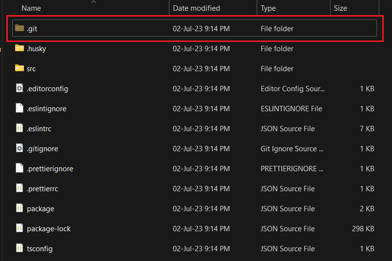

# Khởi tạo git cho project

- Việc đầu tiên khi ta muốn liên kết với **Remote repository** thì ta phải khởi tạo git trong thư mục dự án của chúng ta trước.

## Kiểm tra đã khởi tạo git hay chưa?

- Để biết xem ta đã khởi tạo git cho thư mục dự án hay chưa, ta có 2 cách:
  - **Cách 1** : Bên trong thư mục project, bật chế độ hiển thị các file/folder ẩn lên. Nếu ta thấy thư mục có tên ".git" thì tức là đã khởi tạo git.



- **Cách 2** : Mở terminal trỏ vào thư mục gốc của project, gõ lệnh sau, nếu **true** thì project của chúng ta đã khởi tạo git:

```bash
git rev-parse --is-inside-work-tree
```

## Khởi tạo git

- Nếu project của ta chưa khởi tạo git, ta mở terminal trỏ vào thư mục dự án và gõ:

```bash
git init
```

## Xóa liên kết git

- Nếu ta muốn xóa git trong project, ta có thể xóa thư mục ẩn ".git" (ở ảnh trên), hoặc mở git bash lên và gõ:

```bash
rm -rf .git
```
