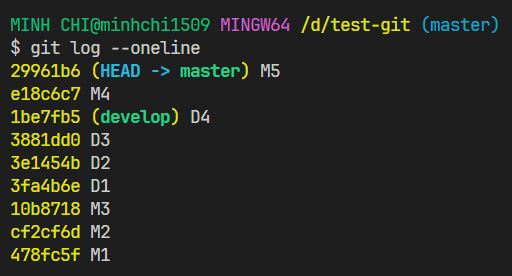

# Git log / Git reflog

## Git log

### Xem thông tin tất cả các commit

- Ta sử dụng lệnh sau để xem tất cả các commit cho đến trạng thái hiện tại mà con trỏ HEAD đang trỏ đến của nhánh hiện tại ở local repository, thông tin mỗi commit sẽ hiển thị trên một dòng:

```bash
git log --oneline
```



### So sánh lịch sử commit ở remote repository với con trỏ HEAD hiện tại ở local repository

- Ví dụ:

```bash
git log origin/main..HEAD
```

:::info

Lệnh `git log origin/main..HEAD` được sử dụng để xem lịch sử các commit trên nhánh hiện tại từ commit gốc (origin/main) đến commit mới nhất (HEAD).

Giải thích chi tiết:

- `git log` là lệnh để xem lịch sử các commit trên nhánh hiện tại.
- `origin/main` là một tham chiếu đến commit gốc trên nhánh `main` trên remote repository (thông thường là origin). Nó đại diện cho commit mới nhất trên nhánh `main` trên remote repository.
- `HEAD` là một tham chiếu đến commit mới nhất trên nhánh hiện tại mà ta đang làm việc.

Khi chạy lệnh `git log origin/main..HEAD`, Git sẽ hiển thị danh sách các commit được thực hiện trên nhánh hiện tại từ commit gốc (origin/main) đến commit mới nhất (HEAD). Điều này giúp ta xem các thay đổi và thông tin về các commit đã được thực hiện trên nhánh của bạn so với commit gốc trên remote repository.

:::

:::caution

- Tùy thuộc vào tên remote repository (**origin**) và nhánh trên remote (**main**) mà điều chỉnh tên cho phù hợp.

:::

### Xem tất cả các commit (kể cả commit đã bị xóa) của tất cả các nhánh

```bash
git log --reflog --oneline
```

## Git reflog

- Lệnh **git reflog** dùng để xem thông tin tham chiếu hiện tại của con trỏ HEAD, lịch sử commit, checkout,...
- Câu lệnh xem lịch sử tham chiếu của tất cả các nhánh:

```bash
git reflog
```


:::info

- **HEAD --> main**: con trỏ HEAD hiện tại đang đứng ở nhánh main, ở commit b56fa45
- **origin/main**: commit mới nhất trên nhánh main ở remote repository là b56fa45
- **origin/develop/feature6** (chữ đỏ): commit mới nhất trên nhánh develop/feature6 ở remote repository là af8d199
- **develop/feature6** (chữ xanh): commit mới nhất mà con trỏ HEAD sẽ đứng khi checkout sang nhánh này là af8d199

:::

- Câu lệnh xem lịch sử tham chiếu của một nhánh cụ thể:

```bash
git reflog show [branch_name]
```
