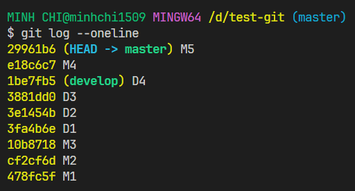
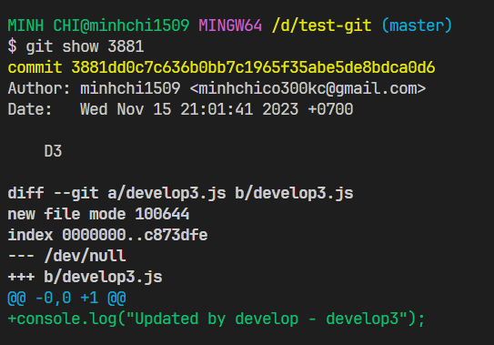

# Git log

- Ta sử dụng lệnh sau để xem tất cả các commit cho đến trạng thái hiện tại mà con trỏ HEAD đang trỏ đến, thông tin mỗi commit sẽ hiển thị trên một dòng:

```bash
git log --oneline
```



- Nếu muốn xem thông tin chi tiết của commit, ta sử dụng lệnh:

```bash
git show <commit_hash>
```

:::note

- Lưu ý: sử dụng từ 4 ký tự trở lên cho mã commit hash

:::


