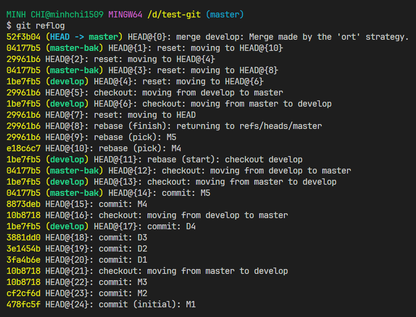
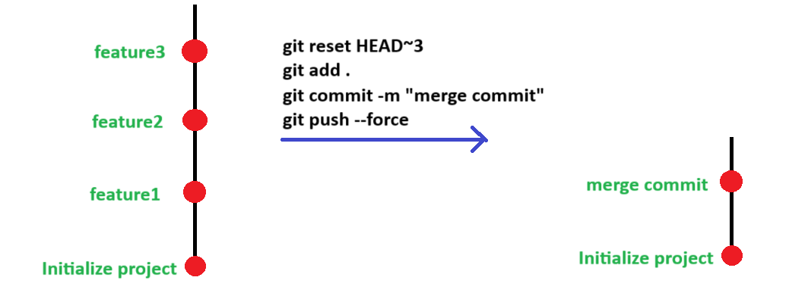

# Git reset

## Con trỏ HEAD

- Trong Git, **HEAD** là một con trỏ đặc biệt trỏ đến commit hiện tại trong branch đang làm việc. Nó thường được sử dụng để đại diện cho commit cuối cùng trong branch hiện tại.
- **HEAD** có thể trỏ đến các commit trực tiếp, hoặc trỏ đến tên branch hiện tại (ví dụ: `master`, `develop`,...). Khi ta thực hiện các thao tác commit, checkout, hoặc chuyển branch, **HEAD** sẽ được cập nhật để tham chiếu đến commit mới nhất.
- Với **HEAD** , ta có thể tham chiếu đến commit hiện tại để xem thông tin về commit đó, di chuyển **HEAD** để chuyển đổi giữa các commit hoặc branch, hoặc sử dụng nó để thực hiện các thao tác khác liên quan đến commit hiện tại.

## Xem lịch sử tham chiếu của HEAD

- Ta sử dụng lệnh sau để log ra các lịch sử tham chiếu của HEAD:

```bash
git reflog
```



## Git reset

- Git reset được dùng để:
  - Quay trở lại commit trước đó trong lịch sử commit của repository
  - Quay trở lại trạng thái tham chiếu của con trỏ HEAD.
- Cú pháp

```bash
git reset <commit_hash>
git reset --soft <commit_hash>
git reset --hard <commit_hash>
```

:::info

- Ngoài ra, thay vì chỉ định commit hash, ta có thể dùng **HEAD~n** để quay trở lại "n" commit trước so với commit hiện tại, ví dụ, lệnh sau sẽ quay trở lại 3 commit trước đó:

```bash
git reset HEAD~3
```

:::

```bash
git reset HEAD@{n}
git reset --soft HEAD@{n}
git reset --hard HEAD@{n}
```

- Sự khác biệt:

| git reset                                                                                                                                   | git reset --soft                                                                                                                       | git reset --hard                                                                                                                                                                                  |
| ------------------------------------------------------------------------------------------------------------------------------------------- | -------------------------------------------------------------------------------------------------------------------------------------- | ------------------------------------------------------------------------------------------------------------------------------------------------------------------------------------------------- |
| Di chuyển đến commit hoặc tham chiếu HEAD cụ thể. Tất cả các file thay đổi sau commit này vẫn sẽ được giữ nguyên trong**Working Directory** | Di chuyển đến commit hoặc tham chiếu HEAD cụ thể. Tất cả các file thay đổi sau commit này vẫn sẽ được giữ nguyên trong**Staging Area** | Di chuyển đến commit hoặc tham chiếu HEAD cụ thể. Tất cả các file thay đổi sau commit này sẽ bị**XÓA SẠCH**, đồng nghĩa với việc đưa thư mục làm việc quay trở lại trạng thái y hệt như commit đó |

:::note

- Sau khi reset về commit trước đó, ta chỉnh sửa và sau đó tạo commit mới và muốn push lên remote, hãy dùng lệnh:

```bash
git push --force
```

- Lưu ý rằng tất cả các commit sau đó sẽ bị ghi đè bởi commit ta vừa mới push lên remote.



- Lúc này, lịch sử commit trên remote repository sẽ giống với lịch sử commit khi ta dùng lệnh **git log --oneline**

:::
