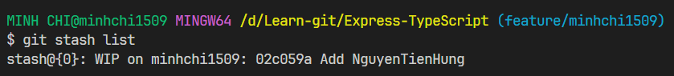

# Git stash

## Vấn đề đặt ra

- Đôi khi ta đang code mà chợt ra ta đang code ở nhầm nhánh. Giờ nếu tạo một nhánh mới, hay di chuyển sang nhánh khác thì toàn bộ các file code thay đổi ở **Working directory** chưa được commit có thể sẽ bị mất hoàn toàn. Giờ làm thế nào để lưu giữ tạm các file code này? Đó là lúc ta sẽ sử dụng lệnh `git stash`
- Lệnh `git stash` trong Git được sử dụng để tạm thời lưu trữ (stash) các thay đổi chưa được commit trong thư mục làm việc hiện tại. Khi bạn chạy `git stash`, Git sẽ tạo một stash mới và loại bỏ các thay đổi chưa được commit khỏi thư mục làm việc. Stash sẽ lưu trữ các thay đổi này để bạn có thể áp dụng lại sau này hoặc chuyển đổi giữa các nhánh mà không phải commit những thay đổi chưa hoàn thành.

## Hiển thị danh sách các Stash hiện có

- Để hiển thị danh sách các Stash hiện có, ta dùng lệnh:

```bash
git stash list
```



## Lưu giữ một stash

- Để tạo một stash cho việc tạm thời lưu trữ các thay đổi hiện tại chưa được commit, ta dùng lệnh:

```bash
git stash
```

## Apply stash

- Để apply một stash cụ thể chứa các thay đổi vào nhánh hiện tại, ta dùng lệnh sau:

```bash
git stash apply stash@{0,1,2,...}
```

- Để apply stash cuối cùng trong Stash list và xóa nó khỏi Stash list sau khi apply xong, ta dùng lệnh:

```bash
git stash pop
```

## Hủy bỏ apply stash

- Để hủy bỏ apply một stash, ta dùng lệnh:

```bash
git checkout -f
```

## Xóa bỏ stash

- Để xóa bỏ một stash cụ thể, ta dùng lệnh:

```bash
git stash drop stash@{0,1,2,3,...}
```

- Để xóa bỏ stash cuối cùng trong stash list, ta dùng lệnh:

```bash
git stash drop
```
