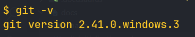

# Giới thiệu chung

- Câu lệnh git là những câu lệnh để quản lý mã nguồn (source code)
- Trước khi sử dụng những lệnh git, đảm bảo hãy cài git bằng cách gõ lệnh sau ở cmd:

```bash
git -v
```



=> Nếu hiển thị như trên ảnh thì đã cài git

- Bước đầu vào những câu lệnh Git cơ bản, ta cần phải biết 2 thuật ngữ sau:
  - **Remote repository** : Kho quản lý source code từ xa (như github, gitlab,...
  - **Local repository** : Kho quản lý source code ở local (như ở vscode)
