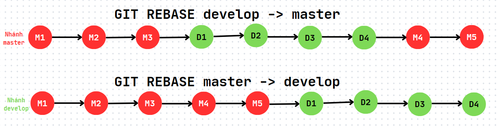

# Git pull / Git merge / Git rebase

## Git pull

- Câu lệnh sau sẽ tự động xác định **Remote** branch tương ứng với branch hiện tại ở **Local** và thực hiện merge:

```bash
git pull --rebase
```

- Câu lệnh sau sẽ merge nhánh được chỉ định ở **Remote** về nhánh hiện tại ở **Local**:

```bash
git pull --rebase origin <remote_branch_name>
```

## Git merge

- Câu lệnh sau sẽ merge một nhánh khác vào nhánh hiện tại:

```bash
git merge <local_branch_name>
```

- Khi thực hiện merge từ một nhánh khác, sẽ có thể xảy ra xung đột. Nếu xảy ra xung đột mà ta muốn hủy bỏ, không muốn merge nữa, thì dùng lệnh:

```bash
git merge --abort
```

## Git rebase

- Cũng giống như `git merge`, `git rebase` cũng dùng để hợp nhất một nhánh khác vào nhánh hiện tại
- Cú pháp:

```bash
git rebase <local_branch_name>
```

- Nếu xảy ra xung đột (conflict), hãy giải quyết bằng tay, sau đó sử dụng lệnh sau:

```bash
git rebase --continue
```

- Nếu xảy ra xung đột mà ta muốn hủy bỏ, không muốn hợp nhất nữa, ta dùng lệnh:

```bash
git rebase --abort
```

# Sự khác nhau giữa Git rebase và Git merge

| Git rebase                                                                                                                                          | Git merge                                                                                                                            |
| --------------------------------------------------------------------------------------------------------------------------------------------------- | ------------------------------------------------------------------------------------------------------------------------------------ |
| Kết quả của git rebase là một cây lịch sử tuyến tính, trong đó các commit từ nhánh khác được chèn trực tiếp lên trên commit gốc của nhánh hiện tại. | Kết quả của git merge là một cây lịch sử phi tuyến, trong đó các commit từ cả hai nhánh được kết hợp lại thành một chuỗi tuyến tính. |

**Bài toán**: Giờ ta có một nhánh **master** đã thực hiện các commit M1, M2, M3 và sau đó ta tạo một nhánh mới tên **develop** từ nhánh **master** ở commit M3. Ở nhánh **develop** này, ta tiếp tục thực hiện các commit D1, D2, D3 và D4. Cùng lúc đó ở nhánh **master**, ta cũng tiếp tục thực hiện hai commit M4 và M5. Xem hình mô tả lịch sử commit của 2 nhánh ở hình bên dưới:


- Lúc này ta thực hiện lệnh `git rebase develop` và `git merge develop` để hợp nhất nhánh **develop** vào nhánh **master**. Lúc này lịch sử commit của nhánh **master** sau khi thực hiện merge và rebase có sự khác biệt sau:


=> Ta có thể thấy khi sử dụng `git rebase`, tất cả các commit từ nhánh **develop** sẽ được "gom" vào làm một nhóm với nhau, trong khi sử dụng `git rebase`, các commit của cả 2 nhánh sẽ được sắp xếp theo thời gian commit (gây lộn xộn các commit giữa 2 nhánh với nhau).

:::tip

- Thông thường ta nên sử dụng `git rebase` để hợp nhất nhánh, vì lịch sử commit sẽ "clean" hơn do nó sắp xếp các commit theo nhánh sau khi hợp nhất các nhánh với nhau, giúp cho việc tìm commit của mình dễ dàng hơn khi làm việc với người khác.
- Vẫn bài toán trên, dưới đây là hình ảnh khi sử dụng `git rebase` để gộp nhánh **develop** vào nhánh **master** và ngược lại:



:::
