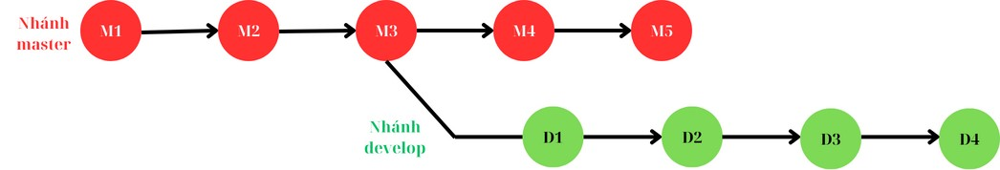
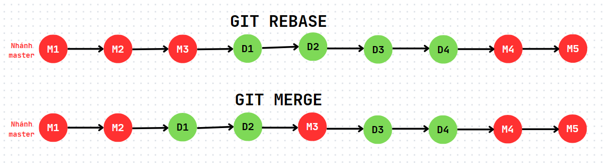
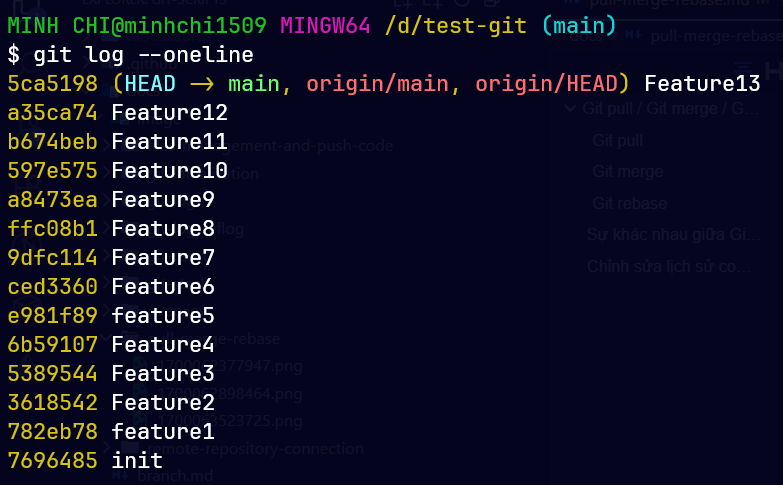
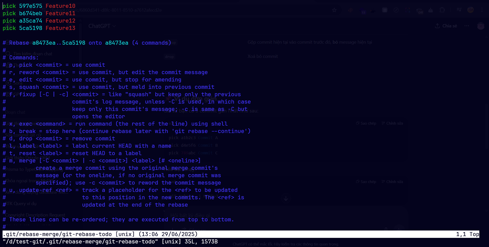
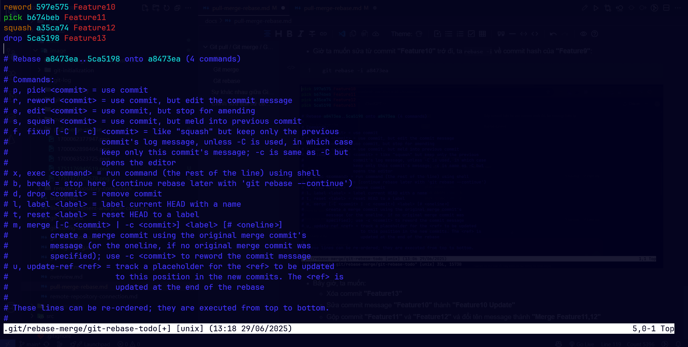
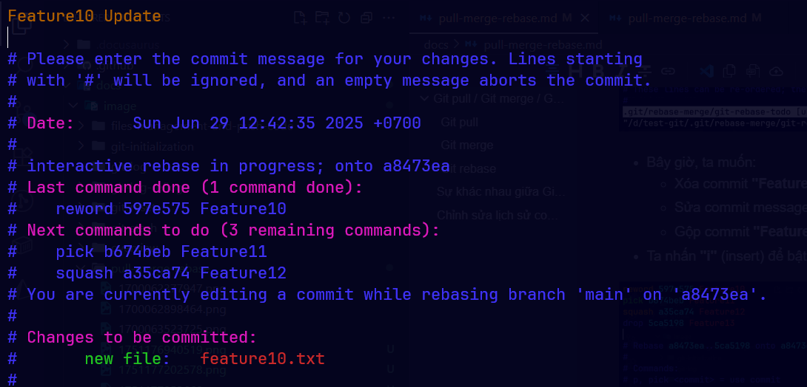
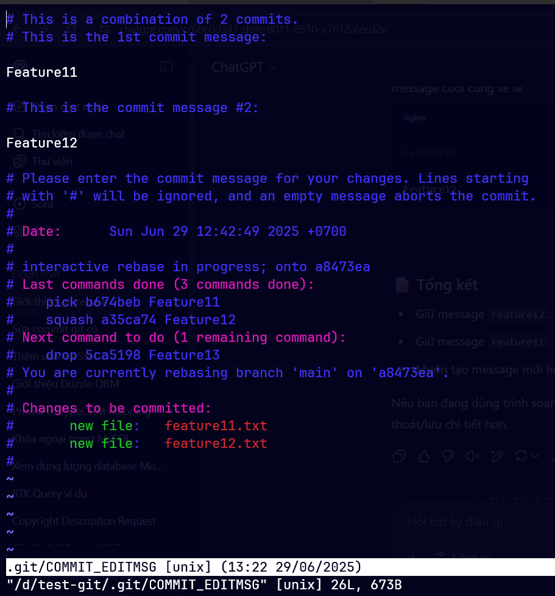
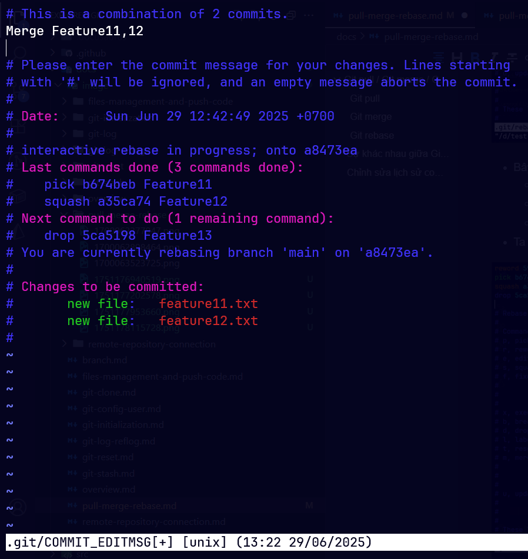
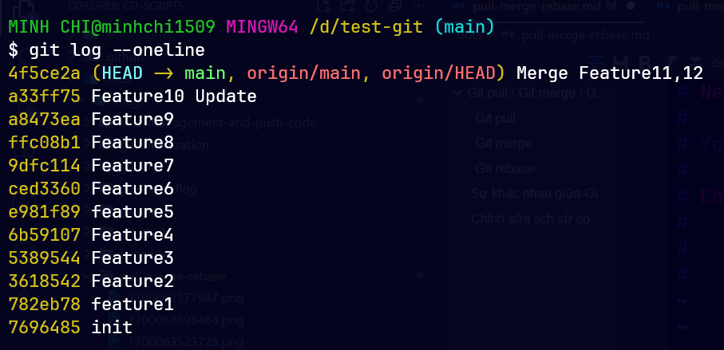

# Git pull / Git merge / Git rebase

## Git pull

- Câu lệnh sau sẽ tự động xác định **Remote** branch tương ứng với branch hiện tại ở **Local** và thực hiện merge:

```bash
git pull --rebase
```

- Câu lệnh sau sẽ merge nhánh được chỉ định ở **Remote** về nhánh hiện tại ở **Local**:

```bash
git pull --rebase origin <remote_branch_name>
```

## Git merge

- Câu lệnh sau sẽ merge một nhánh khác vào nhánh hiện tại:

```bash
git merge <local_branch_name>
```

- Khi thực hiện merge từ một nhánh khác, sẽ có thể xảy ra xung đột. Nếu xảy ra xung đột mà ta muốn hủy bỏ, không muốn merge nữa, thì dùng lệnh:

```bash
git merge --abort
```

## Git rebase

- Lệnh `git rebase` trong Git được dùng để **tái sắp xếp lại lịch sử commit** bằng cách **di chuyển một chuỗi commit lên một base mới**. Nói đơn giản hơn, nó giống như “dán lại” các commit của ta lên một nền tảng khác (ví dụ như một nhánh mới), thay vì trộn commit như `merge`.
- Cú pháp:

```bash
git rebase <local_branch_name>
```

- Nếu xảy ra xung đột (conflict), hãy giải quyết bằng tay, sau đó sử dụng lệnh sau:

```bash
git rebase --continue
```

- Nếu xảy ra xung đột mà ta muốn hủy bỏ, không muốn hợp nhất nữa, ta dùng lệnh:

```bash
git rebase --abort
```

- Ví dụ: Giả sử ta đang làm việc trên nhánh `feature` và muốn cập nhật những thay đổi mới nhất từ nhánh `main`.

```bash
git checkout feature
git rebase main
```

→ Git sẽ lấy toàn bộ các commit mới nhất từ `main`, sau đó “phát lại” các commit trên `feature` lên trên `main`.

:::caution[Lưu ý quan trọng]

`git rebase` **thay đổi lịch sử commit**, vì thế:

- **Không nên rebase** các nhánh đã **đẩy lên remote** mà **nhiều người đang dùng**.
- Nếu rebase rồi, ta cần dùng `git push --force` để đẩy lại (vì lịch sử đã thay đổi).

:::

## Sự khác nhau giữa Git rebase và Git merge

| Git rebase                                                                                                                                          | Git merge                                                                                                                            |
| --------------------------------------------------------------------------------------------------------------------------------------------------- | ------------------------------------------------------------------------------------------------------------------------------------ |
| Kết quả của git rebase là một cây lịch sử tuyến tính, trong đó các commit từ nhánh khác được chèn trực tiếp lên trên commit gốc của nhánh hiện tại. | Kết quả của git merge là một cây lịch sử phi tuyến, trong đó các commit từ cả hai nhánh được kết hợp lại thành một chuỗi tuyến tính. |

**Bài toán**: Giờ ta có một nhánh **master** đã thực hiện các commit M1, M2, M3 và sau đó ta tạo một nhánh mới tên **develop** từ nhánh **master** ở commit M3. Ở nhánh **develop** này, ta tiếp tục thực hiện các commit D1, D2, D3 và D4. Cùng lúc đó ở nhánh **master**, ta cũng tiếp tục thực hiện hai commit M4 và M5. Xem hình mô tả lịch sử commit của 2 nhánh ở hình bên dưới:



- Lúc này ta thực hiện lệnh `git rebase develop` và `git merge develop` để hợp nhất nhánh **develop** vào nhánh **master**. Lúc này lịch sử commit của nhánh **master** sau khi thực hiện merge và rebase có sự khác biệt sau:



=> Ta có thể thấy khi sử dụng `git rebase`, tất cả các commit từ nhánh **develop** sẽ được "gom" vào làm một nhóm với nhau, trong khi sử dụng `git rebase`, các commit của cả 2 nhánh sẽ được sắp xếp theo thời gian commit (gây lộn xộn các commit giữa 2 nhánh với nhau).

## Chỉnh sửa lịch sử commit với `git rebase -i`

- Lệnh `git rebase -i` (viết tắt của `git rebase --interactive`) được dùng để **tương tác và chỉnh sửa lịch sử commit** trong Git. Đây là một công cụ mạnh mẽ giúp ta làm "đẹp" lại lịch sử commit trước khi đẩy code lên repository chung (như GitHub, GitLab...).
- Ta có thể:

| Hành động | Mô tả                                                                 |
| --------- | --------------------------------------------------------------------- |
| `pick`    | Giữ nguyên commit                                                     |
| `reword`  | Sửa **message** của commit                                            |
| `edit`    | Sửa **nội dung** commit (thêm, xoá file...)                           |
| `squash`  | Gộp commit hiện tại với commit trước đó, giữ message của commit trước |
| `fixup`   | Gộp commit hiện tại vào commit trước đó, **bỏ** message hiện tại      |
| `drop`    | Xoá bỏ commit                                                         |

- Giả sử ta có lịch sử commit như sau (đã push lên remote):



- Giờ ta muốn sửa từ commit **"Feature10"** trở đi, ta `rebase -i` về commit hash của **"Feature9"**:

```bash
git rebase -i a8473ea
```



- Bây giờ, ta muốn:
  - Xóa commit **"Feature13"**
  - Sửa commit message **"Feature10"** thành **"Feature10 Update"**
  - Gộp commit **"Feature11"** và **"Feature12"** và đổi tên message thành **"Merge Feature11,12"**
- Ta nhấn **"i"** (insert) để bật chế độ chỉnh sửa, sau khi sửa xong, nhấn **"Esc"** và gõ **":wq"** và cuối cùng ấn **"Enter"**



- Gõ message mới cho commit **"Feature10"**:



- Gõ message mới sau khi gộp 2 commit **"Feature11"** + **"Feature12"**





- Sau khi chỉnh xong, ta đẩy lại lên remote bằng lệnh:

```bash
git push -f
```

- Kết quả:


