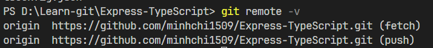

# Liên kết/Hủy liên kết project với Remote repository

## Kiểm tra đã liên kết với Remote repository nào chưa?

```bash
git remote -v
```

:::note

Nếu không có gì thì tức là project của ta chưa liên kết với **Remote repository** nào. Còn nếu xuất hiện như ảnh dưới đây thì là đã được liên kết

- Mặc định tên của **Remote repository** là: `origin`
- Muốn đổi tên **Remote repository** : `git remote rename <Old_name> <New_name>`



:::

## Connect to Remote repository

- Để liên kết với **Remote repository** , ta dùng lệnh sau:

```bash
git remote add <remote-name> <remote_repository_URL>
```

- Ví dụ:

```bash
git remote add <remote-name> https://github.com/minhchi1509/bababa.git
```

## Disconnect to Remote repository

- Nếu ta muốn hủy liên kết với **Remote repository** , ta dùng lệnh sau:

```bash
git remote remove <remote-name>
```

## Cập nhật remote url

- Khi repository trên github được đổi tên, thì ở local ta phải cập nhật lại remote url.

- Câu lệnh để cập nhật remote url:

```bash
git remote set-url <remote-name> <new-url>
```

- Ví dụ:

```bash
git remote set-url origin git@github.com:minhchi1509/tiktok-api-cf-workers.git
```

Hoặc nếu dùng HTTPS:

```bash
git remote set-url origin https://github.com/minhchi1509/tiktok-api-cf-workers.git
```

:::note

- Dùng lệnh `git remote -v` ở trên để xem url cũ ở dạng **ssh** hay **https** để ta chỉ định cho đúng.

:::
